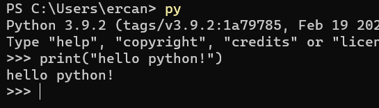

# Giriş

iletişim: [linkedin.com/in/ercanatar/](https://www.linkedin.com/in/ercanatar/)

Hazırlamış olduğum notların tamamını ve daha fazlasını kendi github sayfamda yayınlamaktayım. Bu sayfa içerisinde oluşturduğum notlar eksik veya hatalı olması durumunda ekleme yapabilirsiniz.


[https://github.com/incememed0/python-notes](https://github.com/incememed0/python-notes)


Takip etmiş olduğum dökümanlar ve web siteleri;  
[https://www.w3schools.com/python/default.asp](https://www.w3schools.com/python/default.asp)  
[mustafamuratcoskun/Sifirdan-Ileri-Seviyeye-Python-Programlama/tree/master/](https://nbviewer.jupyter.org/github/mustafamuratcoskun/Sifirdan-Ileri-Seviyeye-Python-Programlama/tree/master/)



Herşeyin başında olan bir kişi öncelikle çalışma ortamını oluşturması gerekir. Aşağıdaki linklerden gerekli programları kurabilirsiniz.


[https://www.jetbrains.com/pycharm/download/\#section=windows](https://www.jetbrains.com/pycharm/download/#section=windows)

[https://www.python.org/downloads/](https://www.python.org/downloads/)


Yüklemiş olduğun python versiyon bilgisini cmd ekranından 3 farklı şekilde kontrol edebilirsin.

```text
python --version
python3 --version
py --version
```

cmd ekranından kısa denemeler yapabilirsin.



## Yorumlar

3 şekilde yorum oluşturabilirsin.

1. Kare işareti ile \#
2. Çift tırnak ile "
3. Tek tırnak ile '

```python
# tek satırlık yorumları '#' işareti ile oluşturuyoruz

""" 
daha uzun ve
satırlarca yorum 
yazmamız gerektiğinde tırnakları kullanabilirsin.
"""

''' veya
tek
tırnakla bile
yorum atabilirsin
'''
```


